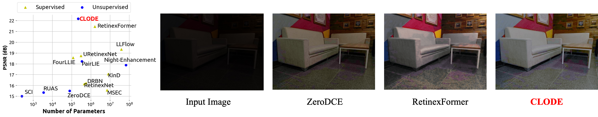

### Continuous Exposure Learning for Low-light Image Enhancement using Neural ODEs <br> (ICLR 2025 Spotlight)
Donggoo Jung*, [Daehyun Kim*](https://github.com/kdhRick2222), Tae Hyun Kim (\*Equal Contribution)

[[ICLR2025] Paper](https://openreview.net/forum?id=Mn2qgIcIPS)



| Under-exposure | Over-exposure | Normal-exposure | 
| :------------: | :-----------: | :-------------: |
| <video src="https://github.com/dgjung0220/CLODE/assets/-" /> | <video src="https://github.com/dgjung0220/CLODE/assets/-" /> | <video src="https://github.com/dgjung0220/CLODE/assets/-" /> |

## TODO:

- Create notebook for Controllability
  

## Evaluation

```bash

```

## User Controllablity

```bash

```

## Results
We provide our results for the LOL and SICE Part2 dataset. (CLODE/**CLODE**$\dagger$)

| Dataset | PSNR | SSIM | Images|
| :------:| :---:| :---:| :---: |
| LOL | 19.61/**23.58** | 0.718/**0.754** | [Link]() |
| SICE | 15.01/**16.18** | 0.687/**0.707** | [Link]() |

## Citation
If you find our work useful in your research, please consider citing our paper.
```bibtex
@article{jung2025continuous,
  title={Continuous Exposure Learning for Low-light Image Enhancement using Neural {ODE}s},
  author={Donggoo Jung and Daehyun Kim and Tae Hyun Kim},
  booktitle={ICLR},
  year={2025},
}
```
